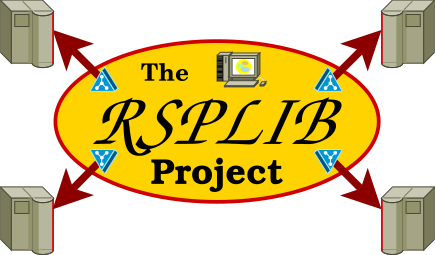

<h1 align="center">
 RSerPool Demo Tool<br />
 <span style="font-size: 30%">The Reliable Server Pooling Demonstration Tool</span><br />
 <a href="https://www.nntb.no/~dreibh/rserpool/">
  <br />
  <span style="font-size: 30%;">https://www.nntb.no/~dreibh/rserpool</span>
 </a>
</h1>


# 💡 What is the RSerPool Demo Tool?

[Reliable Server Pooling&nbsp;(RSerPool)](#what-is-reliable-server-pooling-rserpool) is the new IETF framework for server pool management and session failover handling. In particular, it can be used for realising highly available services and load distribution. RSPLIB is the reference implementation of RSerPool, and RSerPool Demo Tool is a demo tool to showcase RSPLIB based on a Fractal Generator Service example. The demo tool provides an interactive GUI to start, stop, and configure RSPLIB examples, as well as to observe the status of components and their communication associations.


# 📦 Binary Package Installation

Please use the issue tracker at [https://github.com/dreibh/rserpooldemo/issues](https://github.com/dreibh/rserpooldemo/issues) to report bugs and issues!

## Ubuntu Linux

For ready-to-install Ubuntu Linux packages of RSerPool Demo Tool, see [Launchpad PPA for Thomas Dreibholz](https://launchpad.net/~dreibh/+archive/ubuntu/ppa/+packages?field.name_filter=rserpooldemo&field.status_filter=published&field.series_filter=)!

```bash
sudo apt-add-repository -sy ppa:dreibh/ppa
sudo apt-get update
sudo apt-get install rserpooldemo
```

## Fedora Linux

For ready-to-install Fedora Linux packages of RSerPool Demo Tool, see [COPR PPA for Thomas Dreibholz](https://copr.fedorainfracloud.org/coprs/dreibh/ppa/package/rserpooldemo/)!

```bash
sudo dnf copr enable -y dreibh/ppa
sudo dnf install rserpooldemo
```

## FreeBSD

The RSerPool Demo Tool is still waiting for being added to the FreeBSD ports collection ...


# 💾 Build from Sources

RSerPool Demo Tool is released under the [GNU General Public Licence&nbsp;(GPL)](https://www.gnu.org/licenses/gpl-3.0.en.html#license-text).

Please use the issue tracker at [https://github.com/dreibh/rserpooldemo/issues](https://github.com/dreibh/rserpooldemo/issues) to report bugs and issues!

## Development Version

The Git repository of the RSerPool Demo Tool sources can be found at [https://github.com/dreibh/rserpooldemo](https://github.com/dreibh/rserpooldemo):

<pre><code><span class="fu">git</span> clone <a href="https://github.com/dreibh/rserpooldemo">https://github.com/dreibh/rserpooldemo</a>
<span class="bu">cd</span> rserpooldemo
<span class="fu">cmake</span> .
<span class="fu">make</span>
</code></pre>

Contributions:

* Issue tracker: [https://github.com/dreibh/rserpooldemo/issues](https://github.com/dreibh/rserpooldemo/issues).
  Please submit bug reports, issues, questions, etc. in the issue tracker!

* Pull Requests for RSerPool Demo Tool: [https://github.com/dreibh/rserpooldemo/pulls](https://github.com/dreibh/rserpooldemo/pulls).
  Your contributions to RSerPool Demo Tool are always welcome!

* CI build tests of RSerPool Demo Tool: [https://github.com/dreibh/rserpooldemo/actions](https://github.com/dreibh/rserpooldemo/actions).

* Coverity Scan analysis of RSerPool Demo Tool: [https://scan.coverity.com/projects/dreibh-rserpooldemo](https://scan.coverity.com/projects/dreibh-rserpooldemo).

## Release Versions

See [https://www.nntb.no/~dreibh/rserpool/#current-stable-release](https://www.nntb.no/~dreibh/rserpool/#current-stable-release) for release packages!


# 😀 Running the RSerPool Demo

Go to one of the demo directories, and start ```rserpooldemo``` with the corresponding demo configuration file name.

```bash
cd <PATH>/local-scenario
rserpooldemo -config=local-setup.xml
```

Alternatively, if properly installed, a double-click on the configuration file automatically starts the demo tool.


# 🖋️ Citing RSerPool Demo Tool in Publications

RSerPool Demo Tool/RSPLIB and related BibTeX entries can be found in [AllReferences.bib](https://www.nntb.no/~dreibh/rserpool/bibtex/AllReferences.bib)!

[Dreibholz, Thomas](https://www.nntb.no/~dreibh/): «[Reliable Server Pooling – Evaluation, Optimization and Extension of a Novel IETF Architecture](https://duepublico2.uni-due.de/servlets/MCRFileNodeServlet/duepublico_derivate_00016326/Dre2006_final.pdf)» ([PDF](https://duepublico2.uni-due.de/servlets/MCRFileNodeServlet/duepublico_derivate_00016326/Dre2006_final.pdf), 9080&nbsp;KiB, 267&nbsp;pages, 🇬🇧), University of Duisburg-Essen, Faculty of Economics, Institute for Computer Science and Business Information Systems, URN&nbsp;[urn:nbn:de:hbz:465-20070308-164527-0](https://nbn-resolving.org/urn:nbn:de:hbz:465-20070308-164527-0), March&nbsp;7, 2007.


# 🔗 Useful Links

## RSerPool Introductions on Wikipedia in Different Languages

* 🇧🇦 [Bosnian](https://bs.wikipedia.org/wiki/Reliable_Server_Pooling) (thanks to Nihad Cosić)
* 🇨🇳 [Chinese](https://zh.wikipedia.org/wiki/Reliable_Server_Pooling) (thanks to Xing Zhou)
* 🇭🇷 [Croatian](https://web.archive.org/web/20230709054321/https://hr.wikipedia.org/wiki/Reliable_server_Pooling) (thanks to Nihad Cosić)
* 🇬🇧 [English](https://en.wikipedia.org/wiki/Reliable_server_pooling)
* 🇫🇷 [French](https://fr.wikipedia.org/wiki/Reliable_Server_Pooling)
* 🇩🇪 [German](https://de.wikipedia.org/wiki/Reliable_Server_Pooling) (thanks to Jobin Pulinthanath)
* 🇮🇹 [Italian](https://it.wikipedia.org/wiki/Reliable_server_pooling)
* 🇳🇴 [Norwegian (bokmål)](https://no.wikipedia.org/wiki/Reliable_Server_Pooling)

What about helping Wikipedia by adding an article in your language?

## Networking and System Management Software

* [Thomas Dreibholz's Reliable Server Pooling (RSerPool) Page](https://www.nntb.no/~dreibh/rserpool/)
* [NetPerfMeter – A TCP/MPTCP/UDP/SCTP/DCCP Network Performance Meter Tool](https://www.nntb.no/~dreibh/netperfmeter/)
* [HiPerConTracer – High-Performance Connectivity Tracer](https://www.nntb.no/~dreibh/hipercontracer/)
* [TSCTP – An SCTP test tool](https://www.nntb.no/~dreibh/tsctp/)
* [_sctplib_ and _socketapi_ – The User-Space SCTP Library (_sctplib_) and Socket API Library (_socketapi_)](https://www.nntb.no/~dreibh/sctplib/)
* [SubNetCalc – An IPv4/IPv6 Subnet Calculator](https://www.nntb.no/~dreibh/subnetcalc/)
* [System-Tools – Tools for Basic System Management](https://www.nntb.no/~dreibh/system-tools/)
* [Wireshark](https://www.wireshark.org/)

## Simulation and Data Processing Software

* [OMNeT++ Discrete Event Simulator](https://omnetpp.org/)
* [The R Project for Statistical Computing](https://www.r-project.org)

## Other Resources

* [Thomas Dreibholz's SCTP Page](https://www.nntb.no/~dreibh/sctp/)
* [Thomas Dreibholz's Multi-Path TCP (MPTCP) Page](https://www.nntb.no/~dreibh/mptcp/)
* [Michael Tüxen's SCTP page](https://www.sctp.de/)
* [Michael Tüxen's RSerPool page](https://www.sctp.de/rserpool.html)
* [NorNet – A Real-World, Large-Scale Multi-Homing Testbed](https://www.nntb.no/)
* [GAIA – Cyber Sovereignty](https://gaia.nntb.no/)
